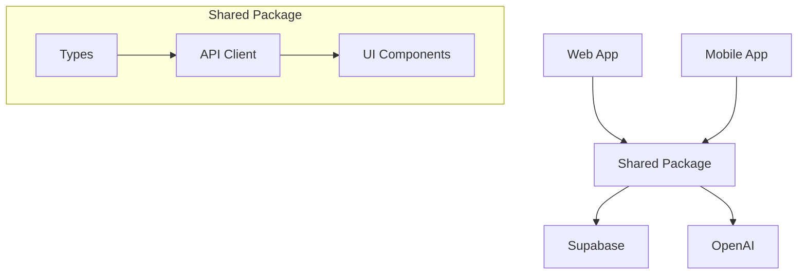

# Chat Frontier Flora

A modern cross-platform chat application built with Expo, React Native, Supabase, and OpenAI.

## Project Structure

This is a monorepo containing:

- `apps/web`: Expo Web application
- `apps/mobile`: React Native mobile application (iOS/Android)
- `packages/shared`: Shared code, types, and API client

### Key Files and Directories

```
.
├── apps/
│   ├── mobile/          # React Native app
│   │   ├── app.json     # Expo configuration
│   │   └── App.tsx      # Root component
│   └── web/             # Web app
│       └── App.tsx      # Root component
├── packages/
│   └── shared/          # Shared code
│       ├── src/         # Source code
│       └── package.json # Dependencies
├── supabase/
│   └── migrations/      # Database migrations
└── package.json         # Root workspace config
```

## Prerequisites

- Node.js >= 18.18 (IMPORTANT: 18.17 will not work with some dependencies)
- npm >= 9.0.0
- Expo CLI: `npm install -g expo-cli`
- iOS Simulator (for iOS development)
- Android Studio (for Android development)
- Supabase CLI (for local development)

## Environment Setup

1. Create a `.env` file in both `apps/web` and `apps/mobile`:

```bash
# OpenAI API Key (Required)
EXPO_PUBLIC_OPENAI_API_KEY=your_openai_api_key_here

# Supabase Configuration (Required)
EXPO_PUBLIC_SUPABASE_URL=your_supabase_url_here
EXPO_PUBLIC_SUPABASE_ANON_KEY=your_supabase_anon_key_here
```

⚠️ IMPORTANT: All environment variables MUST be prefixed with `EXPO_PUBLIC_` to work correctly across platforms.

## Development

1. Install dependencies:
```bash
npm install
```

2. Start the web application:
```bash
npm run dev:web
```

3. Start the mobile application:
```bash
# For iOS
npm run dev:mobile -- --ios

# For Android
npm run dev:mobile -- --android
```

### Common Development Issues and Solutions

1. **Workspace Dependencies**
   - Always use workspace references (`workspace:*`) in package.json
   - Run `npm install` from the root directory
   - Clear npm cache if dependencies aren't resolving: `npm cache clean --force`

2. **TypeScript Configuration**
   - Each workspace has its own tsconfig.json
   - The root tsconfig.json extends shared configurations
   - Use `"baseUrl": "."` and proper path aliases

3. **Environment Variables**
   - Must be prefixed with `EXPO_PUBLIC_`
   - Need to be defined in both web and mobile apps
   - Types must be declared in `env.d.ts`

4. **Platform-Specific Code**
   - Use `.web.tsx`, `.ios.tsx`, `.android.tsx` extensions
   - Import from `react-native` not `react-native-web`
   - Use platform-specific components from shared package

## Database Management

### Migrations

Database migrations are handled through GitHub Actions. When changes are pushed to the `supabase/migrations` directory, they are automatically applied to your Supabase project.

Required GitHub Secrets:
- `SUPABASE_ACCESS_TOKEN`
- `SUPABASE_DB_PASSWORD`
- `SUPABASE_PROJECT_ID`

### Migration Guidelines

1. Name files with timestamp prefix: `YYYYMMDD_description.sql`
2. Include `down` migrations for rollback
3. Test migrations locally before pushing
4. Avoid modifying existing migrations
5. Use proper indexing for performance

## Features

- Cross-platform support (iOS, Android, Web)
- Real-time chat using Supabase
- AI-powered responses using OpenAI
- Shared codebase between platforms
- TypeScript support
- Automatic database migrations

## Architecture



## Best Practices

1. **Code Organization**
   - Keep platform-specific code in respective apps
   - Share common logic through packages/shared
   - Use proper TypeScript types for all APIs

2. **State Management**
   - Use React Query for server state
   - Keep UI state local when possible
   - Document complex state interactions

3. **Performance**
   - Lazy load components when possible
   - Use proper list virtualization
   - Optimize images and assets
   - Monitor bundle size

4. **Testing**
   - Write unit tests for shared logic
   - Test on all target platforms
   - Use proper mocking for external services

## Contributing

1. Fork the repository
2. Create your feature branch (`git checkout -b feature/amazing-feature`)
3. Commit your changes (`git commit -m 'Add some amazing feature'`)
4. Push to the branch (`git push origin feature/amazing-feature`)
5. Open a Pull Request

### Pull Request Guidelines

- Include proper description of changes
- Update documentation as needed
- Add tests for new features
- Ensure all tests pass
- Follow existing code style

## Troubleshooting

### Common Issues

1. **Build Failures**
   - Ensure Node.js version is >= 18.18
   - Clear metro bundler cache: `npm start -- -c`
   - Check for conflicting dependencies

2. **Type Errors**
   - Run `npm run typecheck` in affected workspace
   - Check tsconfig.json references
   - Verify import paths

3. **Environment Issues**
   - Verify all env variables are properly prefixed
   - Check for missing .env files
   - Restart development server

## License

MIT
