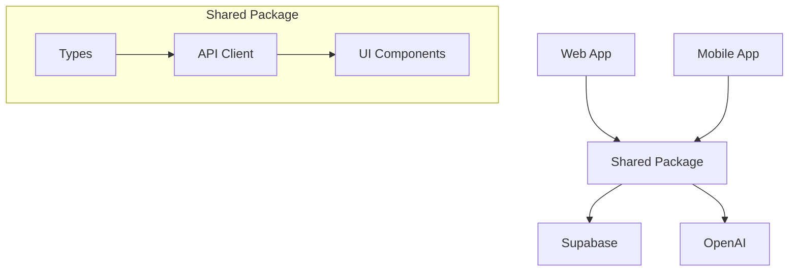

# Frontier.Family

A modern cross-platform chat application built with Expo, React Native, Supabase, and OpenAI.

## Project Structure

This is a monorepo containing:

- `apps/web`: Expo Web application
- `apps/mobile`: React Native mobile application (iOS/Android)
- `packages/shared`: Shared code, types, and API client

### Key Files and Directories

```
.
├── apps/
│   ├── mobile/          # React Native app
│   │   ├── app.json     # Expo configuration
│   │   └── App.tsx      # Root component
│   └── web/             # Web app
│       └── App.tsx      # Root component
├── packages/
│   └── shared/          # Shared code
│       ├── src/         # Source code
│       └── package.json # Dependencies
├── supabase/
│   └── migrations/      # Database migrations
└── package.json         # Root workspace config
```

## 📚 Documentation

Comprehensive project documentation is organized in the `/docs` directory:

- **[docs/README.md](./docs/README.md)** - Documentation index and navigation
- **Architecture & Design** - Routing behavior, project context
- **Authentication** - Complete auth flow documentation and quick reference
- **Testing** - Testing infrastructure, strategy, and protocols
- **Deployment** - Environment setup and deployment guides

## 🔐 Authentication System

This project includes a comprehensive authentication system with user registration, login, and profile management. **The authentication flow was extremely complex to implement correctly.**

### ⚠️ **CRITICAL**: Before modifying authentication code:

- [📚 Authentication Flow Documentation](./AUTHENTICATION_FLOW_DOCUMENTATION.md) - **READ THIS FIRST**
- [🔐 Authentication Quick Reference](./AUTHENTICATION_QUICK_REFERENCE.md) - Developer quick guide

### Key Features

- ✅ Email/password registration and login
- ✅ Real-time form validation with submit button control
- ✅ Secure session management with persistence
- ✅ Role-based user profiles (primary/child accounts)
- ✅ Comprehensive error handling and user feedback

### Critical Files (Handle with Extreme Care)

- `apps/web/src/contexts/AuthContext.tsx` - Core authentication logic
- `apps/web/src/components/auth/SignUpForm.tsx` - User registration form
- `supabase/migrations/20240325_create_user_profiles.sql` - Database schema

## Prerequisites

- Node.js >= 18.18 (IMPORTANT: 18.17 will not work with some dependencies)
- npm >= 9.0.0
- Expo CLI: `npm install -g expo-cli`
- iOS Simulator (for iOS development)
- Android Studio (for Android development)
- Supabase CLI (for local development)

## 🚨 Environment Setup

**CRITICAL: Environment file locations**

- **`.env`** - Located in **root directory** (hidden file)
  - Contains all environment variables for development
  - Includes: `EXPO_PUBLIC_SUPABASE_URL`, `EXPO_PUBLIC_SUPABASE_ANON_KEY`, `OPENAI_API_KEY`, etc.
  - Automatically copied to `apps/web/.env` during build process

```bash
# Verify environment file exists:
ls -la | grep env
cat .env | head -5
```

## Development

### Prerequisites Check
- Node.js >= 18.18 (IMPORTANT: 18.17 will not work)
- npm >= 9.0.0
- Expo CLI: `npm install -g expo-cli`
- OpenAI API key (for E2E testing)

### Getting Started

1. Install dependencies:
```bash
npm install
```

2. **ALWAYS verify environment before starting**:
```bash
npm run status:check
npm run verify:test-env
```

3. Start the web application:
```bash
npm run start:web
```

4. Start the mobile application:
```bash
npm run start:ios
```

5. Run tests safely:
```bash
npm run test:safe
# OR for specific environments:
npm run test:localhost    # Local testing only
npm run test:production   # Production verification only
```

### 🚨 Critical Development Rules

- **NEVER merge to main without preview testing**
- **ALWAYS run from apps/web directory for Expo commands**
- **ALWAYS verify "web compiled with 1 warning" not "1 error"**
- **ALWAYS check environment with `npm run status:check` when in doubt**

### Quick References
- 📋 **Workflow**: See `docs/DEVELOPMENT_WORKFLOW_CHECKLIST.md`
- 🚀 **Commands**: See `docs/QUICK_REFERENCE.md`
- 🧪 **Testing**: See `docs/CURRENT_TEST_INVENTORY.md`

### Common Development Issues and Solutions

1. **Workspace Dependencies**
   - Always use workspace references (`workspace:*`) in package.json
   - Run `npm install` from the root directory
   - Clear npm cache if dependencies aren't resolving: `npm cache clean --force`

2. **TypeScript Configuration**
   - Each workspace has its own tsconfig.json
   - The root tsconfig.json extends shared configurations
   - Use `"baseUrl": "."` and proper path aliases

3. **Environment Variables**
   - Must be prefixed with `EXPO_PUBLIC_`
   - Need to be defined in both web and mobile apps
   - Types must be declared in `env.d.ts`

4. **Platform-Specific Code**
   - Use `.web.tsx`, `.ios.tsx`, `.android.tsx` extensions
   - Import from `react-native` not `react-native-web`
   - Use platform-specific components from shared package

## Database Management

### Migrations

Database migrations are handled through GitHub Actions. When changes are pushed to the `supabase/migrations` directory, they are automatically applied to your Supabase project.

Required GitHub Secrets:
- `SUPABASE_ACCESS_TOKEN`
- `SUPABASE_DB_PASSWORD`
- `SUPABASE_PROJECT_ID`

### Migration Guidelines

1. Name files with timestamp prefix: `YYYYMMDD_description.sql`
2. Include `down` migrations for rollback
3. Test migrations locally before pushing
4. Avoid modifying existing migrations
5. Use proper indexing for performance

## Testing

The project uses Stagehand for E2E testing with natural language actions that adapt to UI changes.

### Running Tests

```bash
# Run all E2E tests
npm run test:e2e

# Run specific test files
npm run test:e2e -- e2e/stagehand-auth-test.spec.ts
npm run test:e2e -- e2e/stagehand-login-test.spec.ts

# Environment-specific testing
npm run test:localhost    # Local testing only
npm run test:production   # Production verification only
```

### Critical Test Implementation Notes

- **Login Tests**: See `docs/LOGIN_TEST_IMPLEMENTATION_GUIDE.md` for comprehensive implementation details
- **Authentication Testing**: Login tests require special handling due to "Remember me" checkbox behavior
- **Test Protection**: See `.cursor/rules/login-test-protection.mdc` for modification guidelines
- **3-Phase Architecture**: All tests use false-failure-prevention architecture (Core → Secondary → Cleanup)

### Test Environment Setup

Create `.env.stagehand` file in project root:
```bash
TEST_LOGIN_EMAIL=your-existing-user@example.com
TEST_LOGIN_PASSWORD=your-test-password
OPENAI_API_KEY=your-openai-api-key
```

## Features

- Cross-platform support (iOS, Android, Web)
- Real-time chat using Supabase
- AI-powered responses using OpenAI
- Shared codebase between platforms
- TypeScript support
- Automatic database migrations

## Architecture



## Best Practices

1. **Code Organization**
   - Keep platform-specific code in respective apps
   - Share common logic through packages/shared
   - Use proper TypeScript types for all APIs

2. **State Management**
   - Use React Query for server state
   - Keep UI state local when possible
   - Document complex state interactions

3. **Performance**
   - Lazy load components when possible
   - Use proper list virtualization
   - Optimize images and assets
   - Monitor bundle size

4. **Testing**
   - Write unit tests for shared logic
   - Test on all target platforms
   - Use proper mocking for external services

## Contributing

1. Fork the repository
2. Create your feature branch (`git checkout -b feature/amazing-feature`)
3. Commit your changes (`git commit -m 'Add some amazing feature'`)
4. Push to the branch (`git push origin feature/amazing-feature`)
5. Open a Pull Request

### Pull Request Guidelines

- Include proper description of changes
- Update documentation as needed
- Add tests for new features
- Ensure all tests pass
- Follow existing code style

## Troubleshooting

### Common Issues

1. **Build Failures**
   - Ensure Node.js version is >= 18.18
   - Clear metro bundler cache: `npm start -- -c`
   - Check for conflicting dependencies

2. **Type Errors**
   - Run `npm run typecheck` in affected workspace
   - Check tsconfig.json references
   - Verify import paths

3. **Environment Issues**
   - Verify all env variables are properly prefixed
   - Check for missing .env files
   - Restart development server

4. **Deployment Issues**
   - See [Deployment Lessons Learned](./DEPLOYMENT_LESSONS_LEARNED.md) for comprehensive troubleshooting
   - Check React version compatibility (must be exact 18.2.0 for React Native)
   - Verify .npmrc configuration for legacy-peer-deps
   - Test builds locally before pushing

## 🚀 Deployment

This project uses Netlify for CI/CD deployment. The deployment process was complex to configure correctly due to React Native Web dependencies.

### Key Documentation

- [📋 NativeWind Component Audit](docs/NATIVEWIND_COMPONENT_AUDIT.md) - **NEW**: Complete catalogue of component NativeWind compliance status
- [📋 Deployment Lessons Learned](./DEPLOYMENT_LESSONS_LEARNED.md) - **Comprehensive troubleshooting guide**
- [🔧 Netlify Development Rules](./.cursor/rules/netlify-development.md) - Platform-specific guidance
- [📋 NativeWind Compatibility Guide](docs/NATIVEWIND_COMPATIBILITY.md) - Essential guidelines for maintaining NativeWind v4.1+ compatibility

### Critical Deployment Requirements

- **React Version**: Must be exact `18.2.0` (no ranges) for React Native Web compatibility
- **NPM Configuration**: Use `legacy-peer-deps=true` in `.npmrc` for monorepo dependency resolution
- **Build Strategy**: Static fallback ensures infrastructure works before adding complexity

### Deployment Checklist

- [ ] React versions are exact `18.2.0` in all packages
- [ ] `.npmrc` contains `legacy-peer-deps=true`
- [ ] No conflicting package-lock.json files
- [ ] Build command works locally
- [ ] Environment variables are properly configured

## License

MIT
