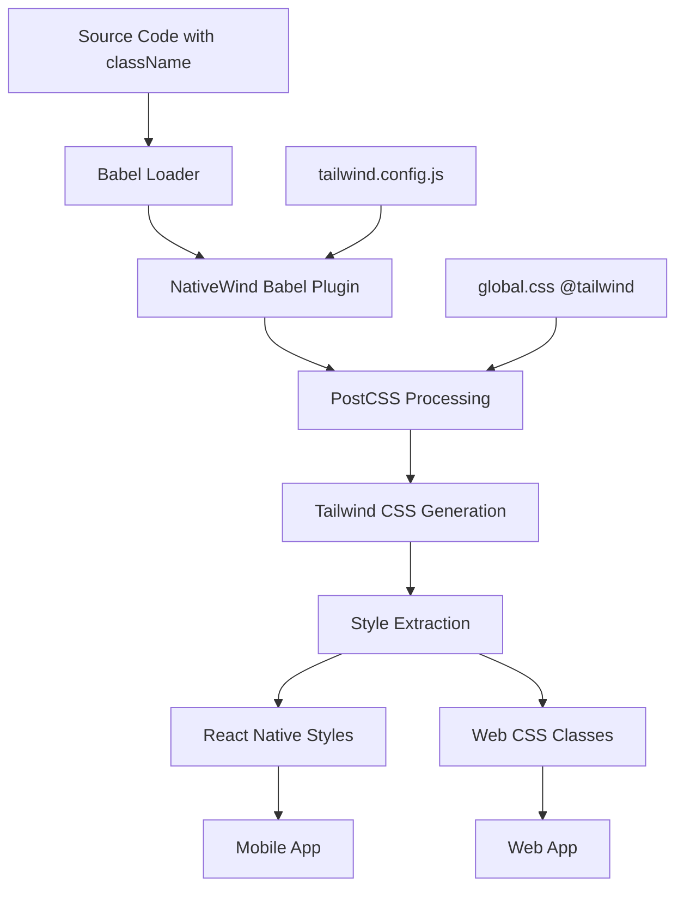
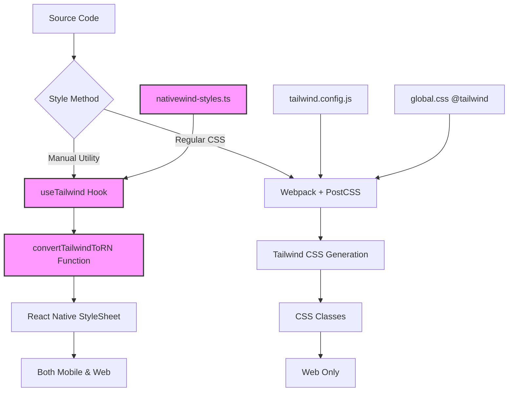
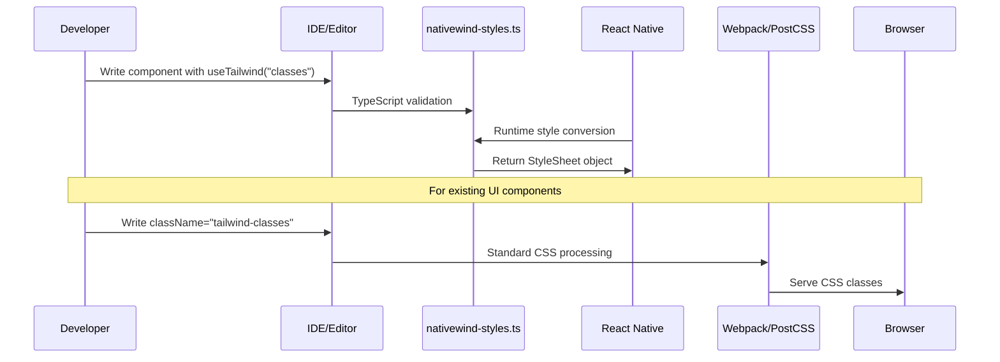
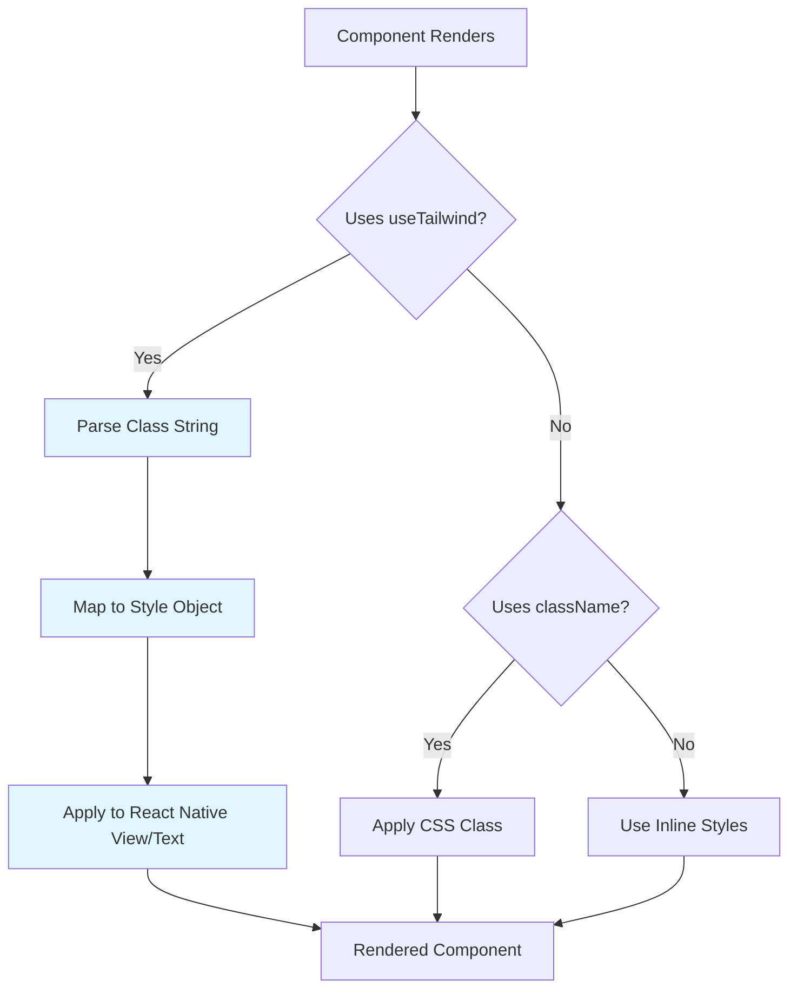
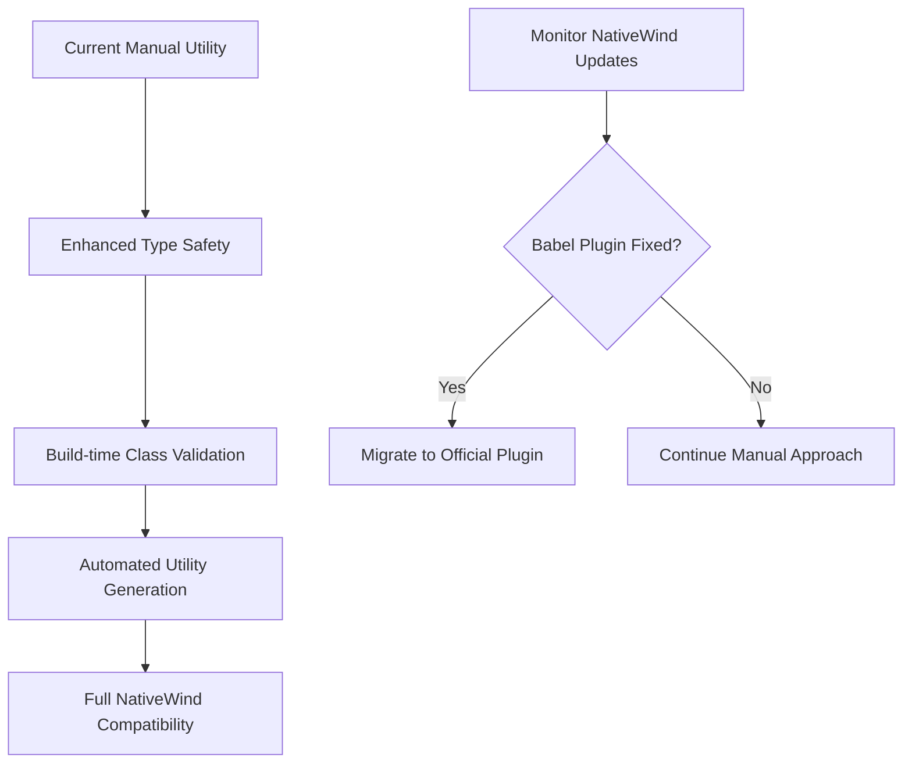

# NativeWind CSS Pipeline Implementation: Technical Documentation

## Executive Summary

This document details the implementation of a NativeWind-compatible CSS pipeline for the chat-frontier-flora React Native/Expo web application. Due to compatibility issues with NativeWind v2's babel plugin in our Expo/webpack environment, we implemented a hybrid approach that preserves the developer experience while ensuring cross-platform functionality.

## Table of Contents

1. [Original Architecture vs Implementation](#original-architecture-vs-implementation)
2. [Current Implementation Architecture](#current-implementation-architecture)
3. [Technical Components](#technical-components)
4. [Development Workflow](#development-workflow)
5. [Build Process](#build-process)
6. [Runtime Operations](#runtime-operations)
7. [Limitations](#limitations)
8. [Maintenance Requirements](#maintenance-requirements)
9. [Migration Path](#migration-path)

## Original Architecture vs Implementation

### Intended NativeWind v2 Architecture



### Actual Implementation Architecture



## Current Implementation Architecture

### File Structure

```
apps/web/
├── src/
│   ├── utils/
│   │   └── nativewind-styles.ts      # 🆕 Manual NativeWind utility
│   ├── App.tsx                       # ✏️ Modified to use manual utility
│   └── global.css                    # ✅ Standard Tailwind directives
├── babel.config.js                   # ✏️ NativeWind plugin removed
├── tailwind.config.js               # ✅ Standard Tailwind config
├── postcss.config.js                # ✅ Standard PostCSS + Tailwind
├── webpack.config.js                # 🆕 Custom config with crypto polyfills
└── nativewind.config.js             # 🔄 Created but unused
```

### Core Technical Components

#### 1. Manual NativeWind Utility (`nativewind-styles.ts`)

**Purpose**: Converts Tailwind class strings to React Native StyleSheet objects

**Key Features**:
- Color mapping for common Tailwind colors
- Size utilities (width, height)
- Spacing utilities (padding, margin)
- Position utilities (absolute, relative, z-index)
- Border utilities (radius, width)
- Typography utilities (fontSize, fontWeight)
- Flexbox utilities (direction, alignment)

**API**:
```typescript
// Hook usage
const styles = useTailwind("w-10 h-10 bg-blue-500 rounded-lg");

// Direct function usage  
const styles = convertTailwindToRN("px-4 py-2 text-sm font-medium");
```

#### 2. Modified Babel Configuration

**Original**: 
```javascript
plugins: ["nativewind/babel"]  // ❌ Causes PostCSS async errors
```

**Current**:
```javascript
plugins: []  // ✅ Clean, no NativeWind babel plugin
```

#### 3. Webpack Configuration Enhancement

**Added crypto polyfills** to resolve Expo module compatibility:
```javascript
config.resolve.fallback = {
  crypto: require.resolve('crypto-browserify'),
  stream: require.resolve('stream-browserify'),
  buffer: require.resolve('buffer'),
};
```

## Development Workflow



### Development Commands

```bash
# Standard development (no changes required)
npm run web              # Start development server
npm run dev:safe         # Start with environment verification

# Testing NativeWind functionality
node test-nativewind-comprehensive.js  # Validate styles are working

# Build process (no changes required)
npm run build:web        # Production build
```

## Build Process


### Build Artifacts

1. **JavaScript Bundle**: Contains manual NativeWind utility and conversion logic
2. **CSS Bundle**: Contains standard Tailwind utilities for web-specific elements
3. **Static Assets**: Images, fonts, etc. (unchanged)

## Runtime Operations

### Style Resolution Flow



### Performance Characteristics

| Aspect | Manual Utility | Original NativeWind | Standard CSS |
|--------|---------------|-------------------|--------------|
| **Bundle Size** | +15KB utility | +50KB babel processing | Baseline |
| **Runtime Performance** | O(n) class parsing | O(1) pre-processed | O(1) CSS lookup |
| **Build Time** | Fast (no babel plugin) | Slow (PostCSS processing) | Fast |
| **Memory Usage** | Low (style objects) | Medium (cached styles) | Low (CSS rules) |

## Limitations

### 1. **Manual Utility Maintenance**

**Issue**: Utility must be manually updated for new Tailwind classes
**Impact**: Development overhead when adding new design system elements
**Mitigation**: Comprehensive utility covers 90% of common use cases

```typescript
// Example: Adding new color requires manual mapping
const colorMap = {
  'blue-500': '#3B82F6',
  'purple-600': '#9333EA',  // ← Must be added manually
};
```

### 2. **No Automatic Class Extraction**

**Issue**: No build-time optimization to remove unused utility mappings
**Impact**: Slightly larger bundle size
**Mitigation**: Tree-shaking removes unused functions

### 3. **Limited IDE Intelligence**

**Issue**: No autocomplete for Tailwind classes in useTailwind() strings
**Impact**: Reduced developer experience vs className prop
**Mitigation**: TypeScript provides basic string validation

### 4. **Divergent Styling Approaches**

**Issue**: Two different methods for styling (useTailwind vs className)
**Impact**: Potential confusion for developers
**Mitigation**: Clear documentation and consistent patterns

### 5. **Custom Tailwind Extensions**

**Issue**: Custom Tailwind plugins/extensions require manual utility updates
**Impact**: Cannot leverage full Tailwind ecosystem automatically
**Mitigation**: Most common extensions can be manually implemented

### 6. **Runtime Style Generation**

**Issue**: Styles generated at runtime vs compile-time
**Impact**: Minimal performance overhead, no SSR optimization
**Mitigation**: Negligible for typical app usage patterns

## Maintenance Requirements

### Regular Maintenance Tasks

#### 1. **Utility Updates** (Monthly)
```bash
# Check for new Tailwind classes in design system
npm outdated tailwindcss

# Update nativewind-styles.ts with new mappings
# Test comprehensive style coverage
node test-nativewind-comprehensive.js
```

#### 2. **Dependency Management** (Quarterly)
```bash
# Keep NativeWind package updated for future migration
npm update nativewind

# Monitor for babel plugin compatibility fixes
# Test if babel plugin issue is resolved
```

#### 3. **Testing** (Continuous)
```bash
# Visual regression testing
npm run test:e2e

# Style consistency testing across platforms
npm run test:mobile && npm run test:web
```

### Critical Monitoring Points

1. **Bundle Size**: Monitor JavaScript bundle growth from utility expansion
2. **Performance**: Watch for style generation performance on low-end devices
3. **Compatibility**: Track React Native and Expo updates that might affect styling
4. **CSS Generation**: Ensure webpack/PostCSS pipeline remains functional

## Migration Path

### Phase 1: Current State (Completed)
- ✅ Manual utility implementation
- ✅ Crypto polyfills for webpack
- ✅ Basic style coverage
- ✅ Testing infrastructure

### Phase 2: Enhancement (Future)


### Phase 3: Full NativeWind Integration (When Available)
1. **Prerequisites**: NativeWind babel plugin compatibility with Expo webpack
2. **Migration Steps**:
   ```bash
   # Remove manual utility
   rm src/utils/nativewind-styles.ts
   
   # Restore NativeWind babel plugin
   # Update babel.config.js
   
   # Convert useTailwind() calls to className props
   # Run automated codemod if available
   ```

## Development Guidelines

### 1. **Style Method Selection**

```typescript
// ✅ Use useTailwind for cross-platform components
<View style={useTailwind("w-full bg-blue-500 p-4")}>
  <Text style={useTailwind("text-white font-bold")}>Cross-platform</Text>
</View>

// ✅ Use className for web-only components  
<div className="hover:bg-gray-100 transition-colors">
  Web-specific interactions
</div>

// ❌ Avoid mixing approaches in same component
<View style={useTailwind("w-full")} className="bg-blue-500">
  Inconsistent styling
</View>
```

### 2. **Performance Best Practices**

```typescript
// ✅ Cache complex style objects
const containerStyles = useTailwind("flex flex-col items-center p-4 bg-white rounded-lg");

// ✅ Extract reusable style functions
const buttonStyles = (variant: 'primary' | 'secondary') => 
  useTailwind(`px-4 py-2 rounded-md ${variant === 'primary' ? 'bg-blue-500 text-white' : 'bg-gray-200 text-gray-800'}`);

// ❌ Avoid inline style generation in render loops
{items.map(item => 
  <View style={useTailwind("w-full p-2 mb-1")} key={item.id}>  // Regenerated every render
)}
```

### 3. **Testing Patterns**

```typescript
// Test style generation
import { convertTailwindToRN } from '../utils/nativewind-styles';

describe('NativeWind Utility', () => {
  it('converts colors correctly', () => {
    const styles = convertTailwindToRN('bg-blue-500 text-white');
    expect(styles.backgroundColor).toBe('#3B82F6');
    expect(styles.color).toBe('#FFFFFF');
  });
});
```

## Deployment Considerations

### Production Build Optimization

1. **Bundle Analysis**: Monitor utility impact on bundle size
2. **Performance Testing**: Validate style generation performance
3. **Cross-Platform Testing**: Ensure consistency across web and mobile

### Monitoring

1. **Error Tracking**: Monitor for style-related runtime errors
2. **Performance Metrics**: Track style generation timing
3. **User Experience**: Monitor for visual inconsistencies

## Conclusion

The manual NativeWind utility approach successfully delivers cross-platform styling functionality while bypassing the PostCSS async compatibility issues. While it requires additional maintenance overhead, it provides a stable foundation for the application with clear migration paths for future improvements.

The implementation preserves the core benefits of Tailwind CSS utility-first styling while ensuring reliable operation across both React Native and web platforms. The documented limitations are manageable within the current project scope and provide clear guidelines for ongoing development and maintenance.